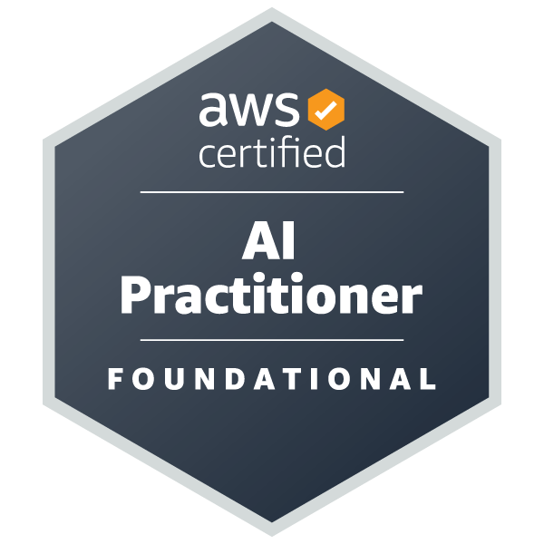

## AI Engineer

My name is Steven, and I am a Computer and Data Engineering graduate. I am a driven and detail-oriented individual with a passion for technology and a desire to gain practical experience in the industry. Throughout my academic career, I have acquired a strong foundation in computer science, programming languages, and data analysis techniques.

- 🌍 I'm based in Hong Kong
- 🖥️ Portfolio: [sintsun.github.io/SintsunWebsite](https://sintsun.github.io/SintsunWebsite/)
- ✉️ Email: [sintsun01@gmail.com](mailto:sintsun01@gmail.com)
- 🧠 Currently learning Node.js
- 🤝 Open to collaborating on interesting projects

---

## Skills

<table>
  <tr>
    <td align="center"> C++</td>
    <td align="center"> Git</td>
    <td align="center"> Java</td>
    <td align="center"> JS</td>
    <td align="center"> Python</td>
    <td align="center"> R</td>
    <td align="center"> VS Code</td>
    <td align="center"> MySQL</td>
  </tr>
  <tr>
    <td align="center"> Figma</td>
    <td align="center"> AWS</td>
    <td align="center"> Linux</td>
    <td align="center"> Docker</td>
    <td align="center"> Arduino</td>
    <td align="center"> PyTorch</td>
    <td align="center"> TensorFlow</td>
    <td align="center"> Raspberry Pi</td>
  </tr>
</table>

---

## Certifications

<table>
  <tr>
    <td align="center">
      
       AWS AI Practitioner
    </td>
    <td align="center">
      
       AWS Cloud Practitioner
    </td>
  </tr>
</table>

---

## Socials

<table>
  <tr>
    <td align="center">
      
       GitHub
    </td>
    <td align="center">
      
       Instagram
    </td>
    <td align="center">
      
       LinkedIn
    </td>
  </tr>
</table>

---

## GitHub Stats

  

